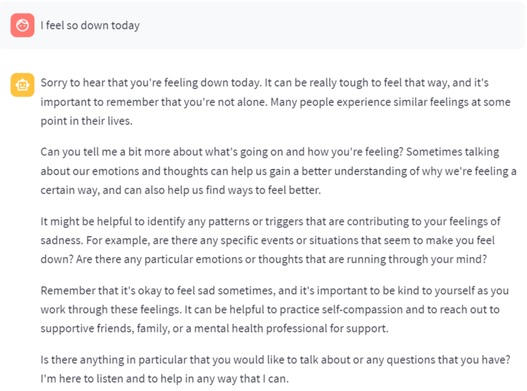
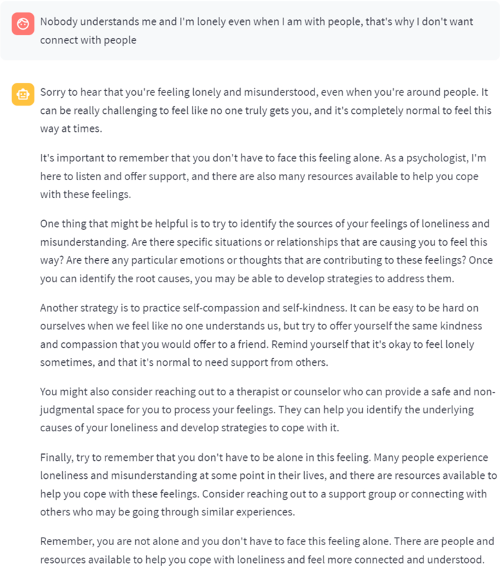

# EmoChatBot

````
Classifiy models are all from Hugging Face
Llama Mode used from Meta-Hugging Face with 7B version 
Deliverable of UTS 32933 Research Project Spring 2023
Supervisor: Dr. Wei Liu
Code Author: Chenling Zhang 
Article Authors: Wei Jie, LiangYi Wang
````

# Project Description

With the rapid pace of human life, many people are facing a lot of pressure in life. As a result, they have more or less certain mental diseases. The main purpose of this project is to use the Large Language model to talk to humans and identify whether people have some negative emotions in their conversations. If we detect negative emotions in the user, our chatbot needs to give the user some suggestions to help them improve their mood.

# How to Use

## Prerequisites

- Before using this project, make sure your python environment is working and the pip tool is upgraded. to make sure your pip is in the latest version please run:

  ```shell
  python -m pip install --upgrade pip
  ```

- If don't install python environment, please install python 3.10 before using this project 

## Install

- Git the latest version of the project through the code below

  ```Shell
  git clone https://github.com/ChenlingZhang/EmoChatBot
  ```

  

- Install all the requirements

  ```Shell
  cd EmoChatBot
  pip install -r requirements.txt
  ```

## Notice

This project only working on the CUDA condition. If you don't have GPU with over 15GB memory this project cannot run successfully. You can try the link below to visit our project website:

> http://34.165.89.151:8501/

# About the Model

## Emotion Classifier

We provide 3 classifiers to help our LLM classify user's emotion. 

- Soiled/deberta-v3-base-tasksource-nil

  Decoding-enhanced BERT with Disentangled AttentionDeBERTa improves the BERT and RoBERTa models using disentangled attentionand enhanced mask decoder. It outperforms BERT and RoBERTa on majority of NLU tasks with 80GB training data.

- Bart-large-mnli

  Bart-large-mnli is a transformer model developed by Facebook that can perform natural language generation,translation, and comprehension tasks. It is based on the BART architecture, which combines a bidirectionalencoder and a causal decoder, and it is fine-tuned on the MultiNLI (MNLI) dataset, which is a collection ofsentence pairs annotated with natural language inference labels1. You can use this model for zero-shot text classification,which is the task of assigning labels to text without any training data2.

- Microsoft/debart-base-mnli

  Decoding-enhanced BERT with Disentangled AttentionDeBERTa improves the BERT and RoBERTa models using disentangled attentionand enhanced mask decoder. It outperforms BERT and RoBERTa on majority of NLU tasks with 80GB training data.

## LLM Model

We used llama2-7B-chat as our large language model. This LLM is published by meta and allow user download from Hugging Face. 

# Experiment Results

The purpose of the experiment is we should find out can our chatbot notice user's emotion and give user some advice for their negative emotion to make them feel better.



As the experiment 1 shows when the user mentioned he feels down today, the chatbot can figure out our user's negative emtion and talk with our user. 



# Future Work

Now our chatbot has been able to effectively identify people's emotions and provide some suggestions to our users to help them improve their mood when they have negative emotions. In the future, we hope to access some psychological medical models to provide long-term psychological services for our users. Long-term conversations with our Large Language Model and the intervention of psychomedical models can help users diagnose if they have some serious mental illness.